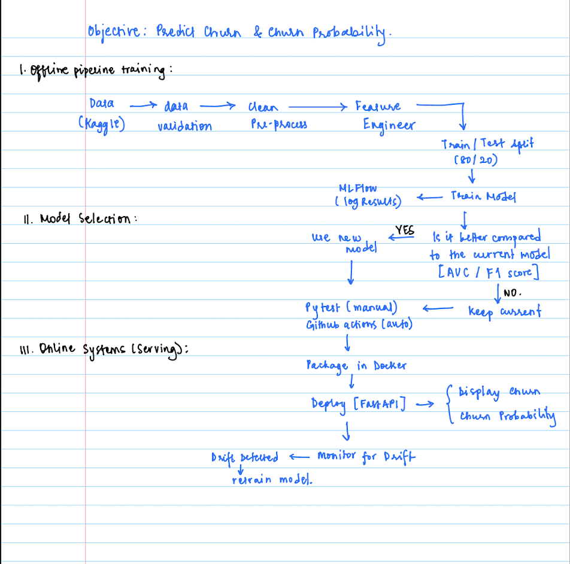

# Telco Customer Churn Prediction

> **Live API:** [Churn Prediction](https://churn-prediction-api-2026.onrender.com)
> Note: The API is hosted on Render's free tier. It goes to sleep after 15 minutes of inactivity, so the first request might take **30-60 seconds** to wake the server up

---

## Overview

The end-to-end pipeline predicts customer churn for a telecommunications provider. This project covers the full ML lifecycle, specifically automated data ingestion from Kaggle, feature engineering, model training with experiment tracking, deployment via Docker, and a live REST API served through FastAPI on Render.

**Dataset:** [Telco Customer Churn - Kaggle](https://www.kaggle.com/datasets/blastchar/telco-customer-churn)

---

## Why this matters

Customer churn directly impacts revenue. Being able to predict churn allows teams to:
- target high-risk customers
- improve retention strategies
- make better business decisions

This project shows how such a system can be built and maintained in practice.

---

## What the system does

At a high level:

- Takes customer data as input  
- Processes and prepares features  
- Trains and evaluates multiple models  
- Deploys the best model as an API  
- Returns:
  - churn prediction (Churn / No Churn)
  - churn probability  

---

## System Flow (Simple View)

Data flows through the following pipeline:



---

## Tech Stack 

| Layer | Tech |
|---|---|
| API Framework | FastAPI + Uvicorn |
| ML & Data | scikit-learn, pandas, numpy |
| Experiment Tracking | MLflow (SQLite backend) |
| Containerisation | Docker |
| Orchestration (local) | Kubernetes (kubectl + k8s manifests) |
| CI/CD | GitHub Actions |
| Cloud Deployment | Render (free tier) |
| Testing | pytest |

---

## Project Structure

```
mlops-churn-pipeline/
│
├── src/
│   ├── ingest_data.py          # Downloads raw dataset from Kaggle
│   ├── validate_data.py        # Checks for missing values and duplicates
│   ├── clean_data.py           # Type conversion and invalid row removal
│   ├── feature_engineering.py  # Encoding + normalisation; saves encoder.pkl & scaler.pkl
│   ├── split_data.py           # Train/test split → data/splits/
│   ├── train_model.py          # Trains multiple models, logs to MLflow, saves best
│   └── mlflow_tracking.py      # Centralised MLflow setup (SQLite URI)
│
├── api/
│   └── app.py                  # FastAPI app with /health and /predict endpoints
│
├── data/
│   ├── raw/                    # Raw CSV
│   ├── processed/              # Cleaned data
│   ├── features/               # Engineered feature set
│   └── splits/                 # X_train, X_test, y_train, y_test CSVs
│
├── models/
│   ├── model.pkl               # Best trained model (RandomForest / LogReg)
│   ├── encoder.pkl             # Fitted OrdinalEncoder for categoricals
│   └── scaler.pkl              # Fitted StandardScaler for numerics
│
├── k8s/
│   ├── deployment.yaml         # Kubernetes Deployment (2 replicas)
│   └── service.yaml            # Kubernetes Service
│
├── tests/
│   ├── test_api.py             # FastAPI endpoint tests (health + predict)
│   ├── test_clean_data.py      # Unit tests for data cleaning
│   └── test_data.py            # Unit tests for data integrity
│
├── logs/
│   └── mlflow.db               # MLflow SQLite tracking store
│
├── .github/
│   └── workflows/
│       └── ci.yml              # GitHub Actions CI/CD pipeline
│
├── Dockerfile
├── .dockerignore
├── requirements.txt
└── README.md
```

---

## CI/CD Pipeline (GitHub Actions)

Each time a push or pull request is made to `main`, the full pipeline gets triggered automatically:

Checkout → Install dependencies → Ingest data (Kaggle) → Clean → Validate → Feature engineering → Split → Train & Evaluate → Run pytest → Save model artifacts → (on push to main) Build & push Docker image → Simulated K8s deploy

Secrets required in your repository settings include:

| Secret | Description |
|---|---|
| `KAGGLE_USERNAME` | Kaggle account username |
| `KAGGLE_KEY` | Kaggle API key |
| `DOCKER_USERNAME` | Docker Hub username |
| `DOCKER_PASSWORD` | Docker Hub password / access token |

---

## API Reference

Base URL: [Churn Prediction](https://churn-prediction-api-2026.onrender.com)
 
### `GET /`
Health check.
 
**Response:**
```json
{ "status": "ok" }
```

---
 
### `POST /predict`
Predicts churn probability for a single customer.
 
**Request body (JSON):**
 
```json
{
  "gender": "Female",
  "SeniorCitizen": 0,
  "Partner": "Yes",
  "Dependents": "No",
  "tenure": 12,
  "PhoneService": "Yes",
  "MultipleLines": "No",
  "InternetService": "DSL",
  "OnlineSecurity": "No",
  "OnlineBackup": "Yes",
  "DeviceProtection": "No",
  "TechSupport": "No",
  "StreamingTV": "Yes",
  "StreamingMovies": "No",
  "Contract": "Month-to-month",
  "PaperlessBilling": "Yes",
  "PaymentMethod": "Electronic check",
  "MonthlyCharges": 70.5,
  "TotalCharges": 800.25
}
```
 
**Response:**
```json
{
  "prediction": "Churn",
  "churn_probability": 0.73
}
```
 
`prediction` is either `"Churn"` or `"No churn"`. `churn_probability` is a float in `[0.0, 1.0]`.
 
---

## Team 

| Member | Role | Responsibilities |
|---|---|---|
| **Fatima** | Data Engineering | Data ingestion, validation, cleaning, feature engineering |
| **Navneeth** | Machine Learning | Train/test split, model training, hyperparameter tuning, evaluation |
| **Anirudh** | MLOps | MLflow experiment tracking, model registry, CI/CD pipeline |
| **Sarah** | Deployment | FastAPI development, Docker containerisation, Render deployment |